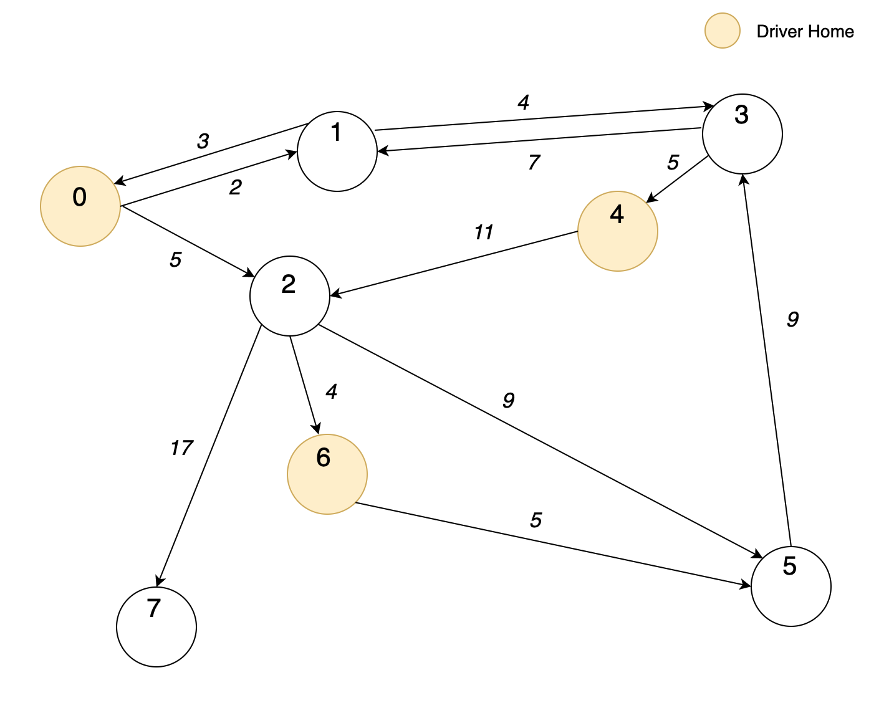

# Uber-Weighted-Directed-Graph-Optimization

## Objective
- Perform graph optimisation for a problem simulating an 'UberHaul' service to transport goods from one location to another.
- Find the lowest cost trip from the driver's home to the client's pick up point to the client's drop off point and back to the driver's home.

## Implementation
The routes that 'UberHaul' drivers take to perform the transport service are modelled as edges in a _weighted directed graph_.
Dijkstra's algorithm is used to calculate the lowest cost path for each transport request.

## Use

### Standard Input Format
The input format includes three main aspects:
- Information regarding number of nodes and edge weights representing _locations and journey costs_
- Number of _available drivers_ and their current home node positions
- Number of _delivery requests_ and desired pick up and drop off locations

```
<number of nodes><newline>
{<source node number> {<destination node number> <weight>}*<newline>}* 
<number of UberHaul drivers><newline>
{<driver’s home node number>}*<newline>
<number of delivery requests><newline>
{<pick-up/source node number> <drop-off/destination node number>}*<newline>
````

where {x}* indicates zero or more of item x.

### Standard Output Format
The output specifies which truck driver can help each respective client as well as the cost for each segment of the journey.

```
client <node Pi> <node Di>
truck <driver’s home node number Tx>
<shortest path from Tx to Pi>
pickup <Pi>
<shortest path from Pi to Di>
dropoff <Di>
<shortest path from Di to Tx>
````

where _Pi_ and _Di_ represents the client's pick up and drop off nodes respectively and _Tx_ represents the driver's home.

### Example

For example, given the following input:

```
8           # total number of nodes/locations
0 1 2 2 5   # specifies edge weights from Node 0 to Node 1 and Node 2 respectively
1 0 3 3 4   
2 5 9 6 4 7 17 
3 1 7 4 5
4 2 11
5 3 9
6 5 5
7
3           # number of available UberHaul drivers
0 4 6       # specifies current location of driver's home nodes
3           # number of delivery requests
2 5 5 1 3 7 # specifies pick up and drop off node numbers
````

The preceding input corresponds to the following graph with nodes representing locations and edges representing the cost of the journey:



This corresponds to the following output:

```
client 2 5  # specifies client pick up and drop off nodes
truck 0     # corresponding truck node best suited for request
0 2         # journey from driver home to pick up
pickup 2
multiple solutions cost 9
dropoff 5
5 3 1 0
client 5 1
truck 0
multiple solutions cost 14
pickup 5
5 3 1
dropoff 1
1 0
client 3 7
cannot be helped
````


## Advanced Features 

### 1. Petrol Consumption according to Size of Truck

As an additional feature, the relative petrol consumption of different size of trucks is included by adding a petrol consumption factor. Trucks are rated according to size as follows:
- S - 1
- M - 2
- L - 3
- XL - 4
Where 1, 2, 3 and 4 represent the petrol consumption of the vehicle according to size.

These sizes are specified in the input directly after the driver's home node number. 
For example, the line:
0 3 4 2 6 3
Specifies drivers at nodes 0, 4 and 6 with a petrol consumption factor of 3, 2 and 3 respectively. 

The petrol factor is then used to determine the best driver as the total cost of the route is multiplied by the petrol factor, and then the driver with the minimum overall cost is chosen. The petrol factor is also used when finding the best route for each leg of the journey in order that the correct overall cost may be determined. 

An example of this feature works as follows:
Input:
```
8  
0 1 2 2 5   
1 0 3 3 4 
2 5 9 6 4 7 17 
3 1 7 4 5
4 2 11
5 3 9
6 5 5
7
3
0 3 4 2 6 3
3
2 5 
#
````
will result in an output of 
```
client 2 5
truck 4
4 2
pickup 2
multiple solutions cost 18
dropoff 5
5 3 4
````

It can be seen that truck 4 is chosen as the best driver due to a combination of its proximity and lower petrol factor. Thus if the petrol consumption factors were to be changed, a different result would occur. (This is a variation of the original example and thus the differences between the original and added petrol feature are evident, as truck 0 is chosen in the original example.)

It can also be observed that the overall cost of the route has been altered by the petrol factor, as can be seen by the 'multiple solutions cost 18' line which was originally 'multiple solutions cost 9'. Hence the effects of the multiplying factor can be clearly seen.  


### 2. Traffic Updates Causing Changes to Graph Weightings

The second updated feature includes processing traffic reports which are interspersed with client requests.
The program first checks if the next sequence of characters represents a client request or a traffic report and thus the program allows for any number of these consecutively. 

If the next sequence represents a traffic report, it will start with the value -1. 
The next two values then represent the start node and end node defining the edge (or route) whose weight must be updated.
The third value represents the traffic factor that should be added onto the original weight of that edge.
In this way, the original information regarding the weight of that route is maintained, while traffic congestion is taken into account by adding a particular value, which can be updated again later if traffic has lessened.

Traffic congestion is specified as follows:
- Light - 1
- Moderate - 2
- Congested - 3
- Heavy - 4
- Traffic jam - 5

When an update is received, the traffic congestion factor will updated for the specified edge. 
Total weight for each edge is thus a combination of the original weight (representing the route length) 
and the current traffic factor (which can change if updated by a later traffic report).
For example, the line
-1 2 6 2
Indicates that the weight of the edge from vertex 2 to vertex 6 must be increased by two in order to reflect moderate traffic.

A full example of this feature works as follows:
```
8
0 1 2 2 5 
1 0 3 3 4
2 5 9 6 4 7 17 
3 1 7 4 5
4 2 11
5 3 9
6 5 5
7
3
0 3 4 2 6 3
3
2 5 
-1 2 6 2
2 5
#
````

Giving an output of:
```
client 2 5
truck 4
4 2
pickup 2
multiple solutions cost 18
dropoff 5
5 3 4
client 2 5
truck 4
4 2
pickup 2
2 5
dropoff 5
5 3 4
````

It can be seen that before the traffic update, the weightings were such that there were multiple solutions for the route from 2 to 5. After the traffic update, there is only one route from 2 to 5. This occurred as the edge from 2 to 6 has increased in weight and thus the alternative route not including this edge is cheaper.


## Final Input Format

```
<number of nodes><newline>
{<source node number> {<destination node number> <weight>}*<newline>}* 
<number of UberHaul drivers><newline>
{<driver’s home node number> <size of vehicle>}*<newline>
<number of delivery requests><newline>
{<pick-up/source node number> <drop-off/destination node number>}*<newline>
{<flag> <startNode> <endNode> <newWeight>}*<newline>
#
````

It is important to note that a # must be entered after all input in order to signify the end of the input
